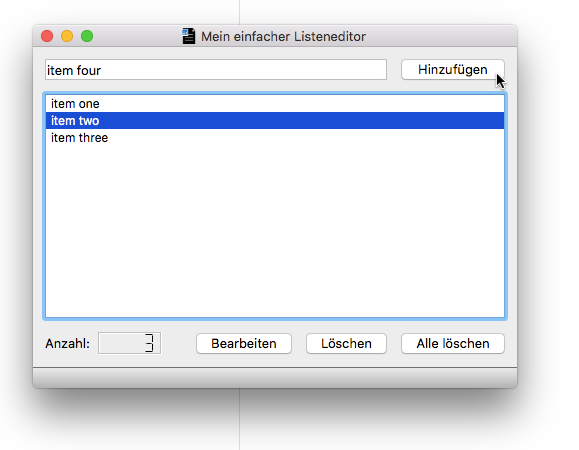

# PyQt5_EduDemo
A simple demonstration of PyQt5 for educational purposes

## Description

This simple project demonstrates some aspects of implementing GUI Applications
with [PyQt5](http://pyqt.sourceforge.net/Docs/PyQt5/). It is still a work in
progress in early development stage. Any help, suggestion and advice is
welcome.

The Application is currently only localized in German. Maybe full localization
support is added some day. The next steps are to develop a step by step
introduction for introducting GUI development to students. So stay tuned.

## Screenshot

